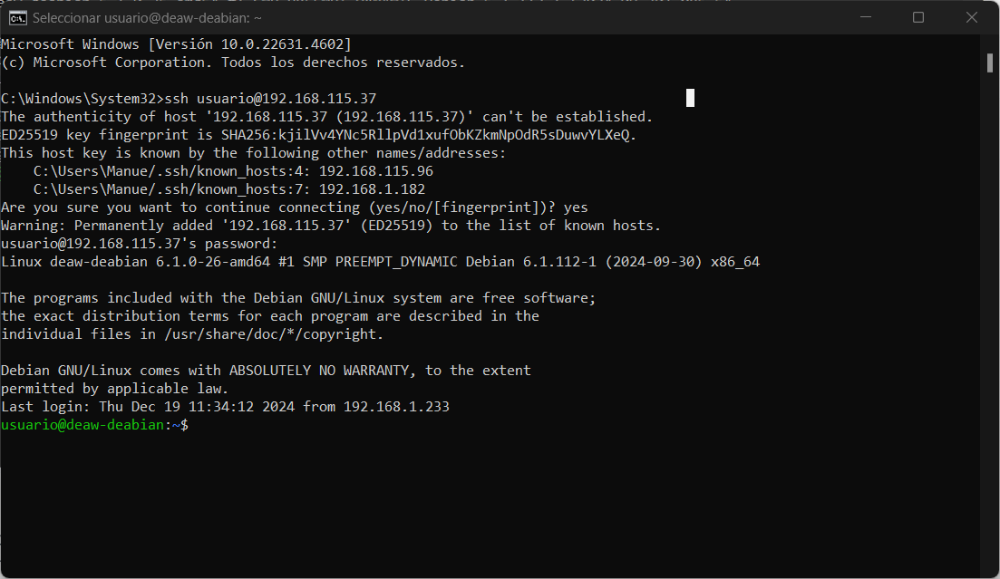
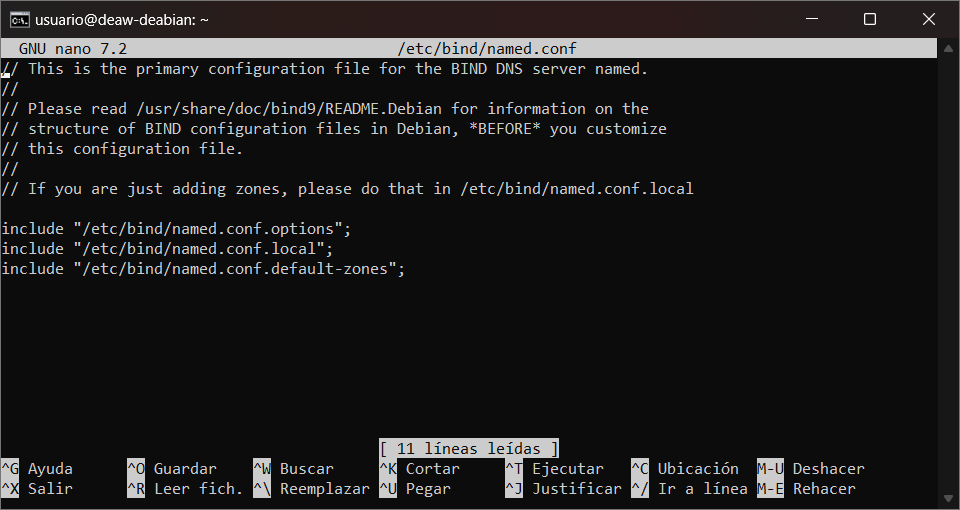
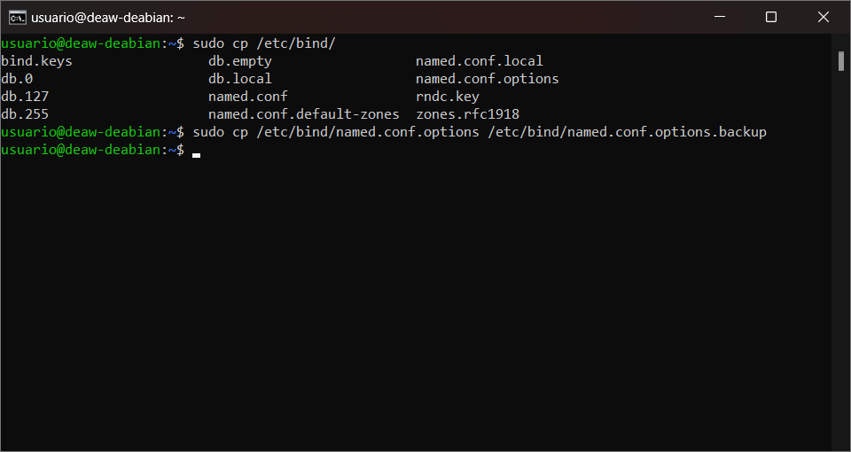
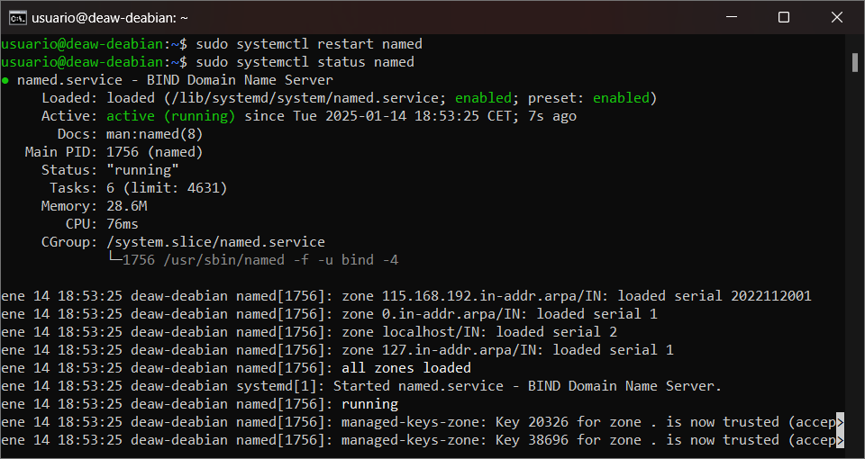

# Práctica 4.1 - Configuración de un servidor DNS

## Introducción
Esta práctica tiene como objetivo configurar un servidor DNS utilizando Bind9, realizar comprobaciones de configuración y responder a preguntas clave para consolidar los conceptos relacionados con los servicios DNS.

## Requisitos previos

- Acceder a la máquina mediante el uso de ssh
  


- Eliminar las entradas en `/etc/hosts`.


## Instalación del servidor DNS
Instalamos el servidor DNS Bind9 y sus utilidades:


## Configuración del servidor

### Configuración inicial
Modificamos el archivo `/etc/default/named` para usar solo IPv4:


### Archivo principal de configuración
El archivo principal `/etc/bind/named.conf` incluye referencias a otros archivos:
- `named.conf.options`
- `named.conf.local`
- `named.conf.default-zones`



### Configuración en `named.conf.options`
Realizamos una copia de seguridad:



Comprobamos la configuración:


Reiniciamos el servicio:


### Configuración en `named.conf.local`
Declaramos la zona directa:


Declaramos la zona inversa:


### Creación del archivo de zona directa
Archivo `/etc/bind/db.deaw.es`:


### Creación del archivo de zona inversa
Archivo `/etc/bind/db.X`:


Comprobamos los archivos:


Reiniciamos Bind9:



## Comprobación del cliente
Configurar el cliente para usar el servidor DNS en la red privada. Comprobar:


## Cuestiones finales

### Cuestión 1
**¿Qué pasa si un cliente de otra red intenta usar tu DNS?**
No funcionará porque la ACL solo permite consultas recursivas desde la red configurada:
```bash
acl "trusted" {
    192.168.X.0/24;
};
```

### Cuestión 2
**¿Por qué permitir consultas recursivas?**
Para que el servidor resuelva nombres de dominio no locales para los clientes confiables.

### Cuestión 3
**¿Es autoritativo el servidor DNS?**
Sí, porque gestiona la zona "deaw.es" declarada como "master" en `named.conf.local`.

### Cuestión 4
**¿Qué es la directiva $ORIGIN y para qué sirve?**
Establece el dominio base para los registros. Se encuentra en los archivos de zona.

### Cuestión 5
**¿Una zona es idéntica a un dominio?**
No, una zona puede ser una parte de un dominio.

### Cuestión 6
**¿Se pueden editar los archivos de zona de un servidor esclavo?**
No, los servidores esclavos sincronizan los datos desde el maestro.

### Cuestión 7
**¿Por qué tener más de un servidor esclavo?**
Para redundancia y alta disponibilidad.

### Cuestión 8
**¿Cuántos servidores raíz existen?**
Existen 13 servidores raíz principales.

### Cuestión 9
**¿Qué es una consulta iterativa de referencia?**
Una consulta donde el servidor DNS responde con la mejor información que tiene, usualmente una referencia a otro servidor.

### Cuestión 10
**¿A qué nombre se mapearía la IP 172.16.34.56 en una resolución inversa?**
Se mapearía a:
```text
56.34.16.172.in-addr.arpa
```

---
